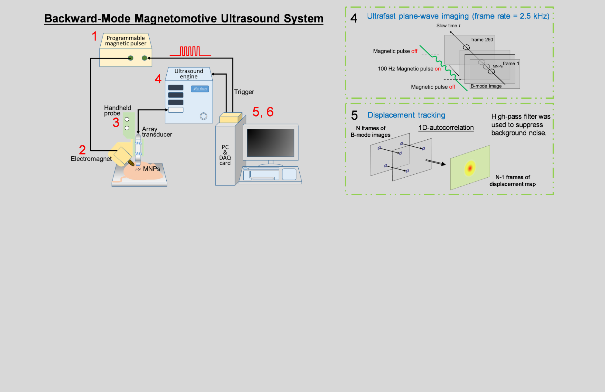
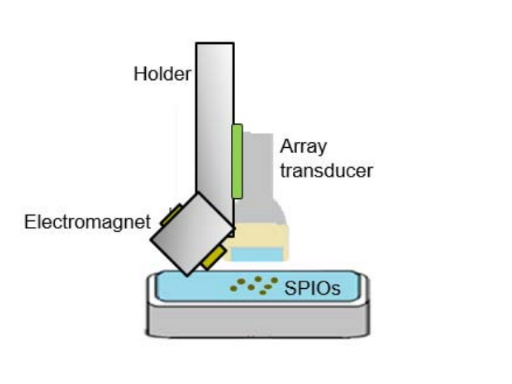

# research-content

## 圖的部分

### 一張大圖（碩二）

這張是要放在首頁的（[像這樣](https://rabbit1010.github.io/Lab705-webpage/)），然後圖的下半部請幫忙留空。可以用我這張圖的範例去改。

### 一張小圖（碩二）

這張是放[這邊](https://rabbit1010.github.io/Lab705-webpage/research.html)的，盡量不要放太複雜的東西，因為圖比較小。

### 頭貼（新生 + 碩一 + 碩二）

請各位檢查一下[頭貼](https://rabbit1010.github.io/Lab705-webpage/people.html)的版型是否正常，太寬太扁的人再用FB或Line給我更新版的。

## 字的部分

### 研究介紹（碩二）

一個關於你研究的摘要，可以分多段。

### People（碩一 + 碩二）

請大家提供一兩個跟自己研究領域有關的關鍵字（英文），會放在[這邊](https://rabbit1010.github.io/Lab705-webpage/people.html)的介紹。譬如：Magnetomotive Ultrasound。

